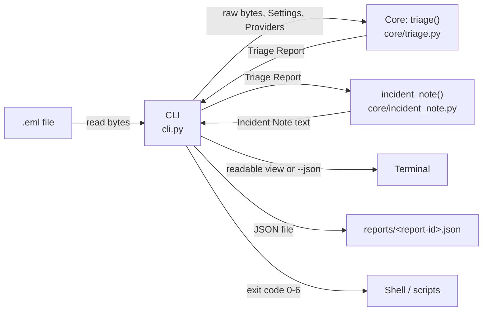

# Architecture

This is a beginner-friendly tour of how the tool is put together. Domain terms in **bold** are defined in [GLOSSARY.md](../GLOSSARY.md).

## The big idea: a core and a thin CLI

The code is split into two parts:

- **The core** (`src/phishing_triage/core/`) does the actual **Triage**. It is given the raw bytes of an email, the settings and a list of **Providers**, and it hands back a **Triage Report**. It never prints anything, never saves files and never reads environment variables.
- **The CLI** (`src/phishing_triage/cli.py`) is the part you run in a terminal. It reads the file, calls the core, prints the result, saves the report and sets the exit code.

Why split them? A later phase will add a web-based alert queue, and it can reuse the same core without dragging the terminal code along. Because the core only takes inputs and returns an output, it is also easy to test: give it an email, check the report.

## How data flows

Step by step:

1. The CLI reads the `.eml` file as bytes. If it can't (missing file, no permission), it stops with exit code 3.
2. The CLI calls `triage()` in the core.
3. The core parses the email. If the input has none of the standard email headers (From, To, Subject, Date and so on), it raises `UnparseableEmailError` and the CLI stops with exit code 4.
4. The core builds the **Triage Report**: metadata (report ID, timestamp, tool version, format version, SHA-256 of the email), the sender and subject, the **Score**, the **Verdict** and any warnings.
5. The CLI prints either the readable view (including the **Incident Note**) or the JSON, then saves the report as JSON. Printing comes first so the analyst still sees the Verdict if saving fails (exit code 6).
6. The CLI turns the Verdict into an exit code: 0 clean, 1 suspicious, 2 malicious.

## The main parts

| File | What it does |
|---|---|
| `core/triage.py` | The one public entry point, `triage()`. It will grow into the pipeline: parse, extract **Observables**, make **Reputation Lookups**, apply rules, score, build the report. |
| `core/report.py` | Defines the **Triage Report** and **Verdict**. This is the one place the report format is defined, including how it becomes JSON. |
| `core/incident_note.py` | Turns a Triage Report into the **Incident Note** text. It only reads the report, so it can't have side effects. Along with `triage()`, it is part of the core's public interface, and tests use it directly. |
| `core/settings.py` | The tunable settings. Empty for now, and filled in as rules arrive. |
| `core/providers.py` | The shape every **Provider** will share. Empty for now, and filled in with the first real Provider. |
| `core/errors.py` | Errors the core can raise to its caller. |
| `cli.py` | The terminal front end: arguments, printing, saving and exit codes. |

## What comes next

The pipeline inside `triage()` currently only parses the email. Later tickets add the stages in between: extracting Observables, Reputation Lookups against Providers (passed in from outside, so tests can use fakes), red-flag rules producing **Findings**, and scoring.
