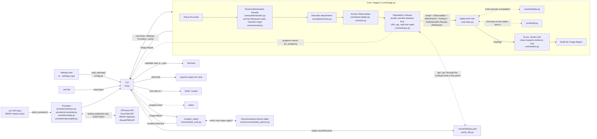

# Architecture

This is a beginner-friendly tour of how the tool is put together. Domain terms in **bold** are defined in [GLOSSARY.md](../GLOSSARY.md).

## The big idea: a core and a thin CLI

The code is split into two parts:

- **The core** (`src/phishing_triage/core/`) does the actual **Triage**. It is given the raw bytes of an email, the settings and a list of **Providers**, and it hands back a **Triage Report**. It never prints anything, never saves files and never reads environment variables.
- **The CLI** (`src/phishing_triage/cli.py`) is the part you run in a terminal. It loads the settings, builds the **Providers** (reading API keys from `.env`), reads the file, calls the core, prints the Verdict and Findings, saves the report and sets the exit code.
- **The real Providers** (`src/phishing_triage/providers/`) talk to outside services: URLhaus, VirusTotal, RDAP (domain registries) and AbuseIPDB. They live outside the core because they do network calls and need keys. The core only knows the shape every Provider shares (`core/providers.py`).

Why split them? A later phase will add a web-based alert queue, and it can reuse the same core without dragging the terminal code along. Because the core only takes inputs and returns an output, it is also easy to test: give it an email, check the report.

## How data flows

Step by step:

1. The CLI loads the settings: the shipped `settings.toml`, or the edited copy given with `--settings`. If the copy is missing or invalid, it stops with exit code 7.
2. The CLI reads the `.eml` file as bytes. If it can't (missing file, no permission), it stops with exit code 3.
3. The CLI builds the Providers, taking API keys from `.env` or the environment (a missing key gives a Provider that answers Not Checked) and the decisive Engine count from the settings, and calls `triage()` in the core.
4. The core parses the email. If the input has none of the standard email headers (From, To, Subject, Date and so on), it raises `UnparseableEmailError` and the CLI stops with exit code 4.
5. The core reads the headers the mail servers added. From the topmost Authentication-Results header it takes SPF, DKIM and DMARC as recorded (pass, fail, another value, or "not recorded"). It never re-checks them. It parses each Received header into a **Hop** (who sent it, the IP seen, which server received it, when), earliest first, and picks the **Claimed Origin**. That is the public IP a **Trusted Relay** recorded, or else the earliest public IP, labelled unverified ([ADR 0011](adr/0011-trust-only-headers-added-after-the-email-reached-us.md)).
6. The core describes each attachment: filename, declared type, size, SHA-256, MD5 and SHA-1, whether it's an archive (judged by its first bytes, name and declared type) and whether a ZIP is password-protected (from its table of contents only). Everything happens in memory; nothing is opened, unpacked or saved.
7. The core extracts the **Observables**: the **Claimed Origin**'s IP address (the only IP that becomes an Observable), the sender's domain (a **Sender Domain**), every URL in the plain-text and HTML bodies (not attachments), decoded offline from defanged text, HTML entities and link wrappers such as SafeLinks, then each URL's domain, then each attachment's SHA-256. Nothing is ever fetched ([ADR 0001](adr/0001-reputation-lookups-only.md)).
8. The core asks every Provider about each Observable of a kind it handles (**Reputation Lookups**): the Claimed Origin (only AbuseIPDB handles it), the Sender Domain and link domains first, then URLs (only the first 10; the rest are Not Checked, "over lookup cap"), then attachment hashes. A fresh answer in the cache is used instead of asking (and without waiting). Otherwise it waits between lookups to keep to each Provider's rate limit, and reports progress through a callback, which the CLI prints to stderr. Each answer is malicious, suspicious, clean, **Unknown** or **Not Checked** with a reason. A Provider that fails or crashes becomes Not Checked; the run carries on. A Provider that says to stop asking (unreachable, no or bad key, rate limited, or crashed) isn't asked again in this Triage ([ADR 0008](adr/0008-pace-providers-and-stop-asking-after-provider-wide-failures.md)).
9. The core runs each red-flag rule. A rule is given a `RuleInput` (the parsed email, its Observables, its attachments, the lookup results, the Authentication Results, the Claimed Origin and the time of the Triage) and returns zero or more **Findings**, each with its points, whether it is decisive, and its evidence.
10. The core adds up the points of the non-decisive Findings into the **Score** (capped at 100) and reaches a **Verdict**: any **Decisive Finding** means malicious, and otherwise the thresholds in the settings decide. Then, if the Verdict is clean but any URL or attachment was Not Checked, it is raised to suspicious, because clean requires evidence.
11. The core builds the **Triage Report**: metadata (report ID, timestamp, tool version, format version, SHA-256 of the email), the sender and subject, the Authentication Results, the Received Hops and Claimed Origin, the Observables, the attachments, every lookup result, what was Not Checked, the Findings, the Score, the Verdict (and the Verdict before the cap, with the reason) and any warnings.
12. The CLI prints either the readable view (including the **Incident Note**) or the JSON, then saves the report as JSON. Printing comes first so the analyst still sees the Verdict if saving fails (exit code 6).
13. The CLI turns the Verdict into an exit code: 0 clean, 1 suspicious, 2 malicious.

## The main parts

| File | What it does |
|---|---|
| `core/triage.py` | The one public entry point, `triage()`. It runs the pipeline: parse, read the Authentication Results and Received chain, describe attachments, extract **Observables**, make **Reputation Lookups**, apply rules, score, build the report. Optional arguments let tests pass their own `rules` and `clock`, and let the CLI pass `on_progress` to show progress. |
| `core/findings.py` | Defines a **Finding**, `RuleInput` (what every rule is given: the parsed email, its Observables, its attachments, the lookup results, the Authentication Results, the Claimed Origin, and `now`, the time of the Triage from the injected clock) and the shape of a rule: a function that takes a `RuleInput` and the settings and returns a list of Findings. |
| `core/authentication.py` | Reads SPF, DKIM and DMARC from the topmost Authentication-Results header into `AuthenticationResults` (coping with headers that don't name their server, as Microsoft 365's don't), keeping each check as recorded for evidence. Never re-checks anything with DNS. |
| `core/received.py` | Parses each Received header into a `ReceivedHop` (earliest first), finding the IP the receiving server saw rather than the name the sender gave. `find_claimed_origin()` picks the **Claimed Origin**, following Trusted Relays down from the top only through internal hand-offs, and stopping at the first public IP ([ADR 0011](adr/0011-trust-only-headers-added-after-the-email-reached-us.md)). |
| `core/attachments.py` | Describes each attachment from the outside: hashes, size, declared type, archive format and the ZIP encryption flag. Also makes filenames safe to print, escaping hidden characters. It never opens, unpacks or saves a file. |
| `core/observables.py` | Defines an **Observable** (a kind, `claimed_origin`, `sender_domain`, `url`, `domain` or `sha256`, and a value) and `extract_observables()`, which builds the list from the Claimed Origin's IP (worked out before it and passed in), the From address's domain, the email's URLs and their domains, and attachment hashes. `describe_observable()` writes one Observable as a safe-to-paste line (label, defanged value, and filenames for a hash), shared by the Incident Note's sections. |
| `core/body.py` | Reads the email's body parts (plain text and HTML, never attachments) and turns them into the text the reader sees: HTML tags, scripts and styles removed, entities decoded. Shared by `core/urls.py` and the urgency rule. |
| `core/urls.py` | Finds URLs in the body parts (from `core/body.py`), decodes obfuscated ones as text (defanged forms, HTML entities, SafeLinks and Google redirect wrappers) and defangs them (and email addresses) for display. It never fetches anything. |
| `core/rules.py` | The built-in red-flag rules. Each one is independent. So far: urgency language (any Urgency Phrase in the subject or body, matched as whole words, ignoring case, spacing and apostrophe style; one Finding quoting each phrase found), AbuseIPDB high confidence (the Claimed Origin's Abuse Confidence at or above `abuse_confidence_threshold`, saying whether the IP is unverified: [ADR 0012](adr/0012-abuseipdb-reports-the-abuse-confidence-and-the-rule-applies-the-threshold.md)), DMARC, SPF and DKIM fail (a recorded fail only; "not recorded" never counts), Reply-To mismatch, display-name impersonation, Lookalike Domain (sender and link domains, one Finding per imitated Protected Domain), URL shortener, risky attachment, newly registered domain (sender or link domain younger than `new_domain_days`, judged against `RuleInput.now`), known malicious (any malicious lookup, decisive), URLhaus domain listed, and VirusTotal low detections (one Finding per URL or attachment some Engines flag, but too few to be decisive, or per flagged domain, since a domain is never decisive: [ADR 0007](adr/0007-virustotal-domain-detections-are-not-decisive.md)). |
| `core/lookalike.py` | Decides whether a domain is a **Lookalike Domain** of a **Protected Domain**, and which trick it uses (swapped characters, one letter off, extra words, the same name on another ending, or non-Latin letters). It knows nothing about emails, so later rules can reuse it for link domains ([ADR 0004](adr/0004-lookalike-detection-with-built-in-rules-of-thumb.md)). |
| `core/verdict.py` | Adds up the Findings into a Score and reaches a Verdict ([ADR 0002](adr/0002-points-plus-decisive-findings.md)). |
| `core/report.py` | Defines the **Triage Report** and **Verdict**. This is the one place the report format is defined, including how it becomes JSON. `TriageReport.iocs()` gives the **IOCs** (Observables a Provider reported as malicious), shared by the Incident Note and the Recommended Actions so they always agree. |
| `core/incident_note.py` | Turns a Triage Report into the **Incident Note** text: a summary line (with the sender's address defanged), the key Findings with their evidence, the IOCs and then the other Observables, all defanged (attachment hashes are shown with their filenames), what was Not Checked and why, then the Recommended Actions. It only reads the report, so it can't have side effects. Along with `triage()`, it is part of the core's public interface, and tests use it directly. `describe_finding()` is shared with the CLI so a Finding reads the same everywhere. |
| `core/recommended_actions.py` | Chooses the **Recommended Actions** for the Incident Note. The whole choice is one table, `RECOMMENDED_ACTIONS`: each row pairs a condition on the Triage Report (the Verdict, which Findings fired, whether the email had links or attachments, whether anything was Not Checked) with the wording of the action (both functions of the report). The IOCs to block are listed defanged; the sender domain is only blocked on its own if it isn't already an IOC, and "close with no action" appears only when no other row applies. Every action is only text: no code path carries one out. Like the Incident Note, it only reads the report ([ADR 0013](adr/0013-recommended-actions-are-chosen-from-one-table.md)). |
| `core/settings.py` | The shape of the tunable settings: Finding points, Verdict thresholds, the **Protected Brands** with their domains, the Urgency Phrases, URL shortener domains, risky attachment extensions, the decisive VirusTotal Engine count, the URL cap, the new-domain limit, the Trusted Relays and the AbuseIPDB confidence threshold. The values come from the settings file. |
| `settings.toml` | The default settings, shipped with the tool ([ADR 0003](adr/0003-settings-in-a-packaged-toml-file.md)). |
| `core/cache.py` | What the cache is to the core: the `LookupCache` shape (`get`, `put`), the cache key (Provider, Observable and decisive Engine count), and how long each outcome stays fresh (malicious 7 days, others 24 hours, Not Checked never) ([ADR 0009](adr/0009-reputation-cache-keyed-on-the-decisive-engine-count.md)). |
| `cache_file.py` | Outside the core: the real cache, a JSON file in `.cache/`, written safely via a temporary file. A damaged file counts as empty, entries over 7 days old are dropped, and a failed save only gives a warning. `WriteOnlyCache` wraps it for `--no-cache`. |
| `config.py` | Outside the core: reads a settings file, checks it against the shipped one and builds the `Settings`. |
| `core/providers.py` | The shape every **Provider** shares: a name, the Observable kinds it handles, its rate limit (`lookups_per_minute`), and `lookup()`, which returns a `Lookup` (an `Outcome` with a detail, raw evidence, and `stop_asking` when it can't answer anything else). There is deliberately no way to submit or scan ([ADR 0001](adr/0001-reputation-lookups-only.md)). |
| `core/lookups.py` | Runs the Reputation Lookups: sender and link domains first, the URL cap, waiting for rate limits, not asking a Provider again once it says to stop, and progress events (`LookupStarted`, `WaitingForRateLimit`, `ProviderStopped`). Each Provider's pacing and stop state live in one `_ProviderTurns` object. Turns any Provider failure into Not Checked, and works out which Observables no Provider answered for. |
| `core/clock.py` | Telling the time and waiting, behind a `Clock` interface, so tests can pass a fake clock that never really waits. |
| `providers/transport.py` | Outside the core: sends HTTP requests (POST for URLhaus, GET for VirusTotal) with Python's `urllib`, behind a `Transport` interface that tests replace with a fake. |
| `providers/urlhaus.py` | Outside the core: the URLhaus Provider. Looks up URLs (listed means malicious) and domains (listed means suspicious, [ADR 0005](adr/0005-urlhaus-domain-listings-are-not-decisive.md)); not listed is Unknown. |
| `providers/virustotal.py` | Outside the core: the VirusTotal Provider. Looks URLs, domains and attachment hashes up with GET requests only (its POST endpoints would submit for scanning). At or above the decisive Engine count is malicious (never for a domain), fewer detections are suspicious, never seen is Unknown, and a URL or domain no Engine vouches for is Unknown rather than clean ([ADR 0006](adr/0006-virustotal-clean-needs-an-engine-to-vouch.md)). |
| `providers/rdap.py` | Outside the core: the RDAP Provider. Finds the domain's registry from IANA's bootstrap list (fetched once per run), asks it when the domain was registered, and trims subdomains until the registry recognises one. Its outcome is always Unknown, with the date (or `None` for unknown age) in the evidence ([ADR 0010](adr/0010-rdap-gives-facts-and-sender-domains-are-observables.md)). |
| `providers/abuseipdb.py` | Outside the core: the AbuseIPDB Provider. Looks the Claimed Origin's IP up with a GET request only (its POST endpoint reports an IP). No recent reports is Unknown, AbuseIPDB's allowlist is clean, and any Abuse Confidence above 0 is suspicious, with it in the evidence for the rule to judge ([ADR 0012](adr/0012-abuseipdb-reports-the-abuse-confidence-and-the-rule-applies-the-threshold.md)). |
| `providers/__init__.py` | Outside the core: `build_providers()` builds every real Provider from the API keys in the environment. |
| `core/errors.py` | Errors the core can raise to its caller. |
| `cli.py` | The terminal front end: arguments, printing (including the Authentication Results, the Received chain and the Claimed Origin with its verified or unverified label), saving and exit codes. |

## What comes next

Later tickets add Wrapper Email handling and an evaluation against public datasets.
