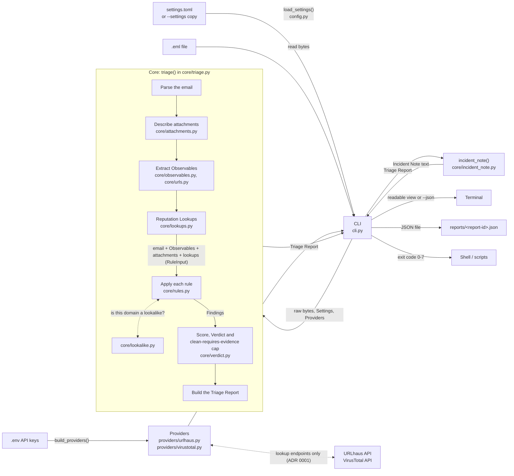

# Architecture

This is a beginner-friendly tour of how the tool is put together. Domain terms in **bold** are defined in [GLOSSARY.md](../GLOSSARY.md).

## The big idea: a core and a thin CLI

The code is split into two parts:

- **The core** (`src/phishing_triage/core/`) does the actual **Triage**. It is given the raw bytes of an email, the settings and a list of **Providers**, and it hands back a **Triage Report**. It never prints anything, never saves files and never reads environment variables.
- **The CLI** (`src/phishing_triage/cli.py`) is the part you run in a terminal. It loads the settings, builds the **Providers** (reading API keys from `.env`), reads the file, calls the core, prints the Verdict and Findings, saves the report and sets the exit code.
- **The real Providers** (`src/phishing_triage/providers/`) talk to outside services: URLhaus and VirusTotal so far. They live outside the core because they do network calls and need keys. The core only knows the shape every Provider shares (`core/providers.py`).

Why split them? A later phase will add a web-based alert queue, and it can reuse the same core without dragging the terminal code along. Because the core only takes inputs and returns an output, it is also easy to test: give it an email, check the report.

## How data flows

Step by step:

1. The CLI loads the settings: the shipped `settings.toml`, or the edited copy given with `--settings`. If the copy is missing or invalid, it stops with exit code 7.
2. The CLI reads the `.eml` file as bytes. If it can't (missing file, no permission), it stops with exit code 3.
3. The CLI builds the Providers, taking API keys from `.env` or the environment (a missing key gives a Provider that answers Not Checked) and the decisive Engine count from the settings, and calls `triage()` in the core.
4. The core parses the email. If the input has none of the standard email headers (From, To, Subject, Date and so on), it raises `UnparseableEmailError` and the CLI stops with exit code 4.
5. The core describes each attachment: filename, declared type, size, SHA-256, MD5 and SHA-1, whether it's an archive (judged by its first bytes, name and declared type) and whether a ZIP is password-protected (from its table of contents only). Everything happens in memory; nothing is opened, unpacked or saved.
6. The core extracts the **Observables**: every URL in the plain-text and HTML bodies (not attachments), decoded offline from defanged text, HTML entities and link wrappers such as SafeLinks, then each URL's domain, then each attachment's SHA-256. Nothing is ever fetched ([ADR 0001](adr/0001-reputation-lookups-only.md)).
7. The core asks every Provider about each Observable of a kind it handles (**Reputation Lookups**). Each answer is malicious, suspicious, clean, **Unknown** or **Not Checked** with a reason. A Provider that fails or crashes becomes Not Checked; the run carries on.
8. The core runs each red-flag rule. A rule is given a `RuleInput` (the parsed email, its Observables, its attachments and the lookup results) and returns zero or more **Findings**, each with its points, whether it is decisive, and its evidence.
9. The core adds up the points of the non-decisive Findings into the **Score** (capped at 100) and reaches a **Verdict**: any **Decisive Finding** means malicious, and otherwise the thresholds in the settings decide. Then, if the Verdict is clean but any URL or attachment was Not Checked, it is raised to suspicious, because clean requires evidence.
10. The core builds the **Triage Report**: metadata (report ID, timestamp, tool version, format version, SHA-256 of the email), the sender and subject, the Observables, the attachments, every lookup result, what was Not Checked, the Findings, the Score, the Verdict (and the Verdict before the cap, with the reason) and any warnings.
11. The CLI prints either the readable view (including the **Incident Note**) or the JSON, then saves the report as JSON. Printing comes first so the analyst still sees the Verdict if saving fails (exit code 6).
12. The CLI turns the Verdict into an exit code: 0 clean, 1 suspicious, 2 malicious.

## The main parts

| File | What it does |
|---|---|
| `core/triage.py` | The one public entry point, `triage()`. It runs the pipeline: parse, apply rules, score, build the report. Extracting **Observables** and making **Reputation Lookups** will slot in before the rules. It takes an optional `rules` argument so tests can pass their own rules. |
| `core/findings.py` | Defines a **Finding**, `RuleInput` (what every rule is given: the parsed email and its Observables, with lookup results to come) and the shape of a rule: a function that takes a `RuleInput` and the settings and returns a list of Findings. |
| `core/attachments.py` | Describes each attachment from the outside: hashes, size, declared type, archive format and the ZIP encryption flag. Also makes filenames safe to print, escaping hidden characters. It never opens, unpacks or saves a file. |
| `core/observables.py` | Defines an **Observable** (a kind, `url`, `domain` or `sha256`, and a value) and `extract_observables()`, which builds the list from the email's URLs and attachment hashes. |
| `core/urls.py` | Finds URLs in the body parts, decodes obfuscated ones as text (defanged forms, HTML entities, SafeLinks and Google redirect wrappers) and defangs them for display. It never fetches anything. |
| `core/rules.py` | The built-in red-flag rules. Each one is independent. So far: Reply-To mismatch, display-name impersonation, Lookalike Domain (sender and link domains, one Finding per imitated Protected Domain), URL shortener, risky attachment, known malicious (any malicious lookup, decisive), URLhaus domain listed, and VirusTotal low detections (one Finding per URL or attachment some Engines flag, but too few to be decisive, or per flagged domain, since a domain is never decisive: [ADR 0007](adr/0007-virustotal-domain-detections-are-not-decisive.md)). |
| `core/lookalike.py` | Decides whether a domain is a **Lookalike Domain** of a **Protected Domain**, and which trick it uses (swapped characters, one letter off, extra words, the same name on another ending, or non-Latin letters). It knows nothing about emails, so later rules can reuse it for link domains ([ADR 0004](adr/0004-lookalike-detection-with-built-in-rules-of-thumb.md)). |
| `core/verdict.py` | Adds up the Findings into a Score and reaches a Verdict ([ADR 0002](adr/0002-points-plus-decisive-findings.md)). |
| `core/report.py` | Defines the **Triage Report** and **Verdict**. This is the one place the report format is defined, including how it becomes JSON. |
| `core/incident_note.py` | Turns a Triage Report into the **Incident Note** text: a summary line, the key Findings with their evidence, every Observable defanged (attachment hashes are shown with their filenames), then what was Not Checked and why. It only reads the report, so it can't have side effects. Along with `triage()`, it is part of the core's public interface, and tests use it directly. `describe_finding()` is shared with the CLI so a Finding reads the same everywhere. |
| `core/settings.py` | The shape of the tunable settings: Finding points, Verdict thresholds, the **Protected Brands** with their domains, URL shortener domains, risky attachment extensions and the decisive VirusTotal Engine count. The values come from the settings file. |
| `settings.toml` | The default settings, shipped with the tool ([ADR 0003](adr/0003-settings-in-a-packaged-toml-file.md)). |
| `config.py` | Outside the core: reads a settings file, checks it against the shipped one and builds the `Settings`. |
| `core/providers.py` | The shape every **Provider** shares: a name, the Observable kinds it handles, and `lookup()`, which returns a `Lookup` (an `Outcome` with a detail and raw evidence). There is deliberately no way to submit or scan ([ADR 0001](adr/0001-reputation-lookups-only.md)). |
| `core/lookups.py` | Runs the Reputation Lookups, turning any Provider failure into Not Checked, and works out which Observables no Provider answered for. |
| `providers/transport.py` | Outside the core: sends HTTP requests (POST for URLhaus, GET for VirusTotal) with Python's `urllib`, behind a `Transport` interface that tests replace with a fake. |
| `providers/urlhaus.py` | Outside the core: the URLhaus Provider. Looks up URLs (listed means malicious) and domains (listed means suspicious, [ADR 0005](adr/0005-urlhaus-domain-listings-are-not-decisive.md)); not listed is Unknown. |
| `providers/virustotal.py` | Outside the core: the VirusTotal Provider. Looks URLs, domains and attachment hashes up with GET requests only (its POST endpoints would submit for scanning). At or above the decisive Engine count is malicious (never for a domain), fewer detections are suspicious, never seen is Unknown, and a URL or domain no Engine vouches for is Unknown rather than clean ([ADR 0006](adr/0006-virustotal-clean-needs-an-engine-to-vouch.md)). |
| `providers/__init__.py` | Outside the core: `build_providers()` builds every real Provider from the API keys in the environment. |
| `core/errors.py` | Errors the core can raise to its caller. |
| `cli.py` | The terminal front end: arguments, printing, saving and exit codes. |

## What comes next

Later tickets add more Providers (AbuseIPDB, RDAP), lookup orchestration (de-duplication, the URL cap, rate limits), a cache, and more rules and kinds of Observable (IP addresses).
