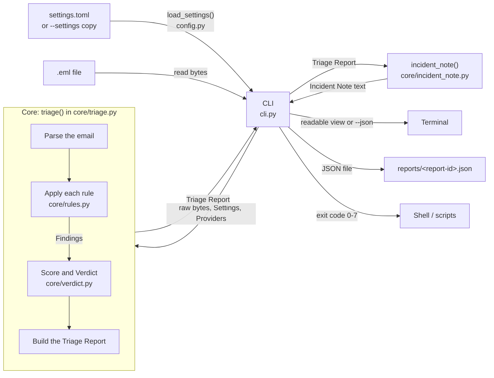

# Architecture

This is a beginner-friendly tour of how the tool is put together. Domain terms in **bold** are defined in [GLOSSARY.md](../GLOSSARY.md).

## The big idea: a core and a thin CLI

The code is split into two parts:

- **The core** (`src/phishing_triage/core/`) does the actual **Triage**. It is given the raw bytes of an email, the settings and a list of **Providers**, and it hands back a **Triage Report**. It never prints anything, never saves files and never reads environment variables.
- **The CLI** (`src/phishing_triage/cli.py`) is the part you run in a terminal. It loads the settings, reads the file, calls the core, prints the Verdict and Findings, saves the report and sets the exit code.

Why split them? A later phase will add a web-based alert queue, and it can reuse the same core without dragging the terminal code along. Because the core only takes inputs and returns an output, it is also easy to test: give it an email, check the report.

## How data flows

Step by step:

1. The CLI loads the settings: the shipped `settings.toml`, or the edited copy given with `--settings`. If the copy is missing or invalid, it stops with exit code 7.
2. The CLI reads the `.eml` file as bytes. If it can't (missing file, no permission), it stops with exit code 3.
3. The CLI calls `triage()` in the core.
4. The core parses the email. If the input has none of the standard email headers (From, To, Subject, Date and so on), it raises `UnparseableEmailError` and the CLI stops with exit code 4.
5. The core runs each red-flag rule. A rule looks at the email and returns zero or more **Findings**, each with its points, whether it is decisive, and its evidence.
6. The core adds up the points of the non-decisive Findings into the **Score** (capped at 100) and reaches a **Verdict**: any **Decisive Finding** means malicious, and otherwise the thresholds in the settings decide.
7. The core builds the **Triage Report**: metadata (report ID, timestamp, tool version, format version, SHA-256 of the email), the sender and subject, the Findings, the Score, the Verdict and any warnings.
8. The CLI prints either the readable view (including the **Incident Note**) or the JSON, then saves the report as JSON. Printing comes first so the analyst still sees the Verdict if saving fails (exit code 6).
9. The CLI turns the Verdict into an exit code: 0 clean, 1 suspicious, 2 malicious.

## The main parts

| File | What it does |
|---|---|
| `core/triage.py` | The one public entry point, `triage()`. It runs the pipeline: parse, apply rules, score, build the report. Extracting **Observables** and making **Reputation Lookups** will slot in before the rules. It takes an optional `rules` argument so tests can pass their own rules. |
| `core/findings.py` | Defines a **Finding** and the shape of a rule: a function that takes the email and the settings and returns a list of Findings. |
| `core/rules.py` | The built-in red-flag rules. Each one is independent. So far: Reply-To mismatch. |
| `core/verdict.py` | Adds up the Findings into a Score and reaches a Verdict ([ADR 0002](adr/0002-points-plus-decisive-findings.md)). |
| `core/report.py` | Defines the **Triage Report** and **Verdict**. This is the one place the report format is defined, including how it becomes JSON. |
| `core/incident_note.py` | Turns a Triage Report into the **Incident Note** text: a summary line, then the key Findings with their evidence. It only reads the report, so it can't have side effects. Along with `triage()`, it is part of the core's public interface, and tests use it directly. `describe_finding()` is shared with the CLI so a Finding reads the same everywhere. |
| `core/settings.py` | The shape of the tunable settings: Finding points and Verdict thresholds. The values come from the settings file. |
| `settings.toml` | The default settings, shipped with the tool ([ADR 0003](adr/0003-settings-in-a-packaged-toml-file.md)). |
| `config.py` | Outside the core: reads a settings file, checks it against the shipped one and builds the `Settings`. |
| `core/providers.py` | The shape every **Provider** will share. Empty for now, and filled in with the first real Provider. |
| `core/errors.py` | Errors the core can raise to its caller. |
| `cli.py` | The terminal front end: arguments, printing, saving and exit codes. |

## What comes next

Later tickets add more rules and the stages before them: extracting Observables, and Reputation Lookups against Providers (passed in from outside, so tests can use fakes).
